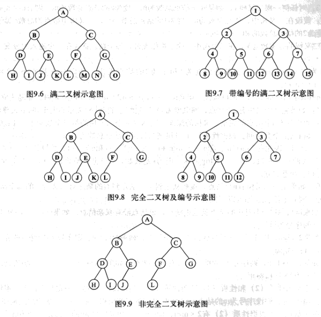

# 满二叉树与完全二叉树

## 满二叉树

每层结点都是满的二叉树称为满二叉树，即在满二叉树中，每一层的结点都具有最大的结点个数。

> 在满二叉树中，每个结点的度为2或者0（即叶子结点），不存在度为1的结点

## 完全二叉树

如果一颗二叉树有n个结点，并且二叉树的n个结点的结构与满二叉树的前n个结点的结构完全相同，则称这样的二叉树为完全二叉树。

> ==若二叉树的层数为k，则满二叉树的叶子结点一定在第k层，而完全二叉树的叶子结点一定在第k层或者第k-1层。==
>
> （满二叉树一定为完全二叉树，完全二叉树不一定是满二叉树）

# 练习

## 题1

Q：已知一颗完全二叉树的第6层（设根为第1层）有8个叶子结点，则该完全二叉树的结点个数最多为（）

A：39	B：52	C：111	D：119

> ==[D]==
>
> 完全二叉树第6层有叶子结点→则第6层为最后一层or倒数第二层
>
> ↓
>
> 当第6层为倒数第二层时（即树高为7层时），总的结点个数最多（完全二叉树最后一层之上是个满二叉树）
>
> ↓
>
> 深度为k的二叉树最多有$ 2^{k}-1$ 个结点→树高为7的满二叉树总结点个数为$ 2^{7}-1$
>
> ↓
>
> 若第6层有8个叶子节点→第7层缺失了$8 \times 2=16$个结点
>
> ↓
>
> 完全二叉树结点个数最多=$(2^{7}-1)-16=111$个

