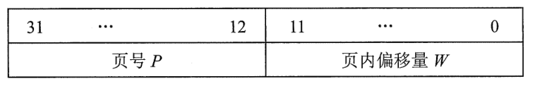

非连续分配：将一个程序分散装入不相邻的内存分区（离散存储）。

# 1.分页存储管理

## 1）基本概念

> 将主存和进程都划分为大小相等且固定的`块`，进程以块为单位申请主存

### ① 页面和页框

页：进程中的块（别名：页面）

页框：内存中的块（别名：页帧=内存块=物理块=物理页面）

### ②地址结构

### ③页表

+ 页表：记录进程各页面与主存块之间的对应关系
+ 页表由页表项组成，页表项=页号+块号（页表项是连续存放的，因此页号是隐含的，不占存储空间，类似于数组下标）
+ 页表的功能由一组专门的存储器实现，其始地址存放在页表基址寄存器（PTBR）中

## 2）基址地址变换机构

# 2.分段存储管理