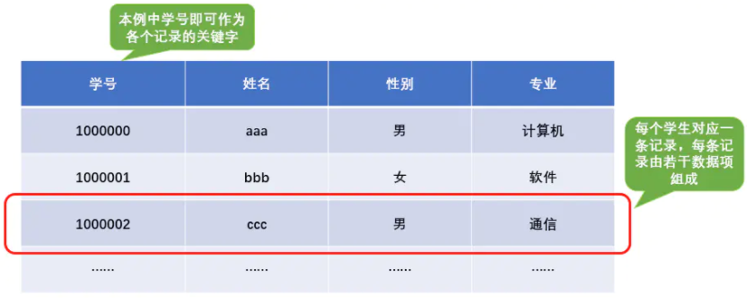
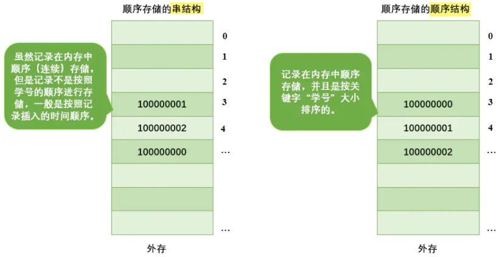
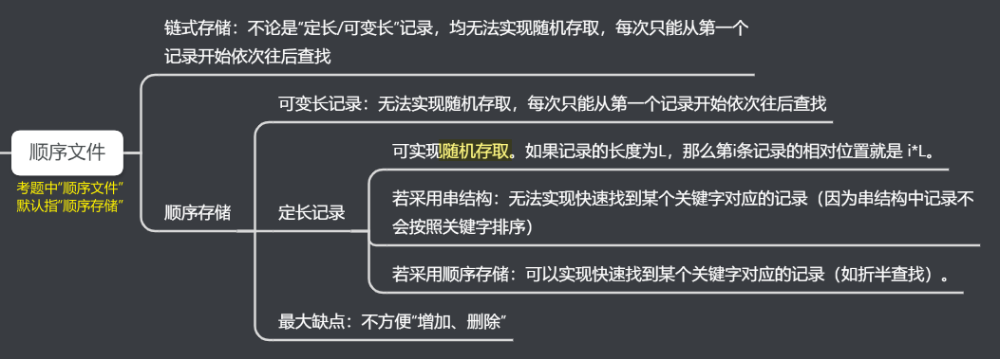
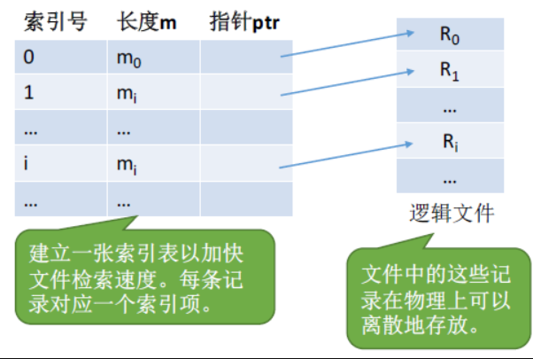
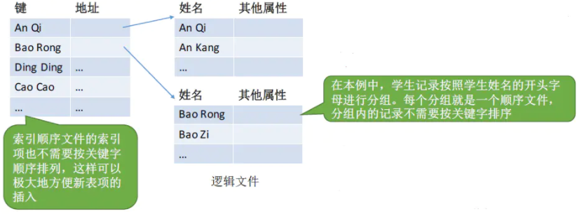
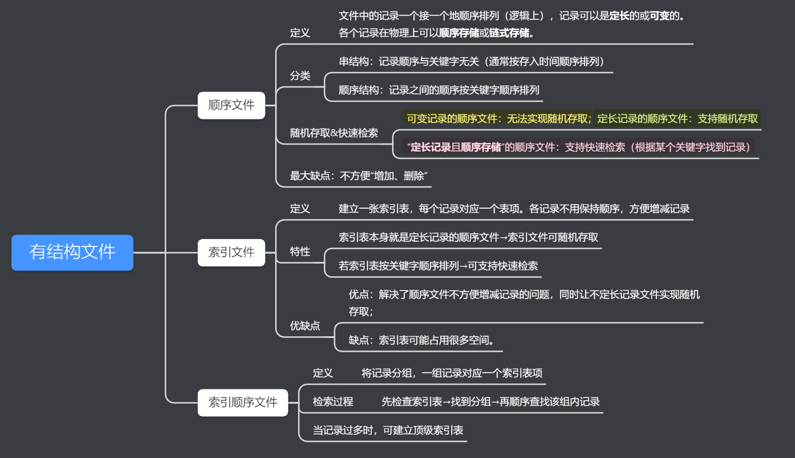
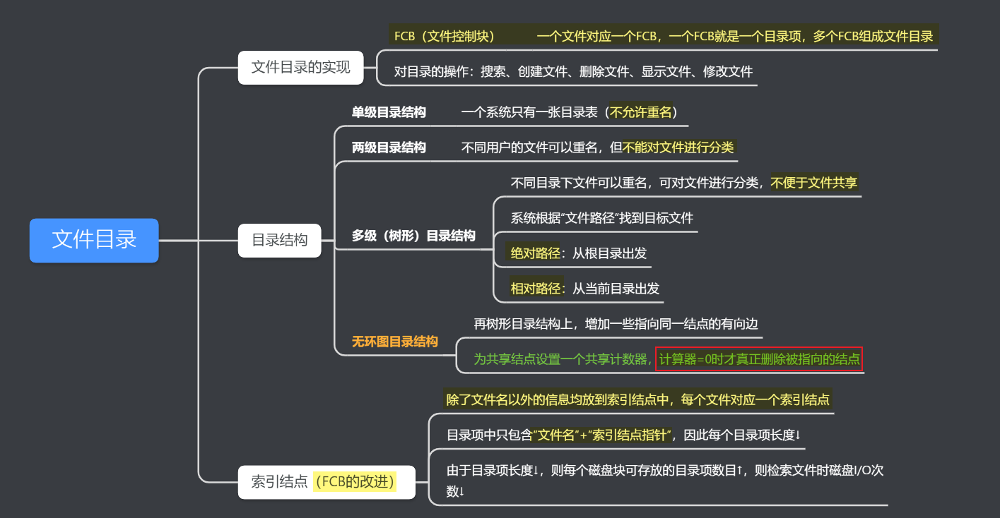
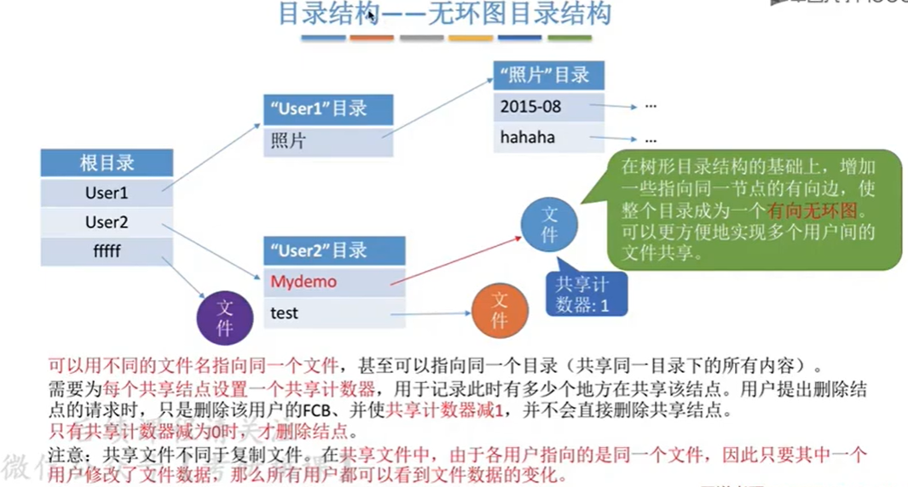

[TOC]

# 一、文件的逻辑结构

逻辑结构：指在`用户`看来，文件内部的数据应该如何组织起来；

物理结构：指在`操作系统`看来，文件的 数据是如何存放在外存当中的。

> 类似于数据结构的“逻辑结构”和“物理结构”。
> 如“线性表”就是一种逻辑结构，在用户角度看来，线性表就是一组有先后关系的元素序列，如：a,b,c,d,e...
> “线性表”这种逻辑结构可以用不同的物理结构实现，如：顺序表/链表。顺序表的各个元素在逻辑上相邻，在物理上也相邻；而链表的各个元素在物理上可以是不相邻的。因此，顺序表可以实现“随机访问”，而“链表”无法实现随机访问。

## 1、无结构文件（流式文件）

定义：文件内部的数据就是一系列二进制流或者字符流组成（没有明显的结构特性）。（如Windows操作系统中的.txt文件）

## 2、`有结构文件`

定义：由一组相似的记录组成，又称“`记录式文件`”。每条记录又由若干个数据项组成。如：数据库表文件。

一般来说，每条记录有一个数据项可作为`关键字`（作为识别不同的ID）。根据各条记录的长度（占用的存储空间）是否相等，又可分为`定长记录`和`可变长记录`两种。

> 定长：每条记录长度固定相等；可变长：各记录长度不一。

有结构文件中的各条记录在逻辑上如何组织，可以分为三类：`顺序文件`、`索引文件`、`索引顺序文件`。

### 1）顺序文件

#### ①定义

文件中的记录一个接一个地顺序排列（逻辑上），记录可以是**`定长`**的或**`可变`**的。各个记录在物理上可以**`顺序存储`**或**`链式存储`**。

#### ②分类

##### | 串结构

记录顺序与关键字无关（通常按存入时间顺序排列）

##### | 顺序结构

记录之间的顺序按关键字顺序排列

#### ③小总结：

### 2）索引文件

#### ①定义

对于可变长记录文件，要找到第i个记录，就必须要先查找前i-1个记录，但是可变长在很多应用场景中又是必须的，所以就有了索引表。

定义：建立一张索引表，每个记录对应一个表项。各记录不用保持顺序，方便增减记录。

> 索引表本身就是定长记录的顺序文件→索引文件可随机存取
>
> 若索引表按关键字顺序排列→可支持快速检索==（由于索引文件有很快的检索速度，因此主要用于对信息处理的及时性较高的场合。）==

#### ②优缺点

优点：解决了顺序文件不方便增减记录的问题，同时让不定长记录文件实现随机存取；

缺点：索引表可能占用很多空间。

> 每条记录对应一个索引表项，因此**索引表可能会很大**。如果文件每个记录平均只占8B，而每个索引表项占32个字节，那么索引表都要比文件内容本身大4倍，这样对存储空间的利用率太低了。

### 3）索引顺序文件

#### ①定义

针对索引文件的缺点，引入索引顺序文件。

定义：索引顺序文件中，同样会为文件建立一张索引表，但是不同的是，并不是每个记录对应一个索引表项，而是**`将记录分组，一组记录对应一个索引表项`**。（索引顺序文件是索引文件和顺序文件思想的结合）

> 检索记录时：先检查索引表→找到分组→再顺序查找该组内记录

下图，将按照学生姓名的首字母进行了分组，首字母相同的分为一组，索引表和分组内的记录都没有按照关键字排序。这样可以大大减少索引表所占的空间大小。

> 如果一个顺序文件中有10000个记录，则根据关键字检索文件，只能从头开始查询，对于索引文件（未按关键字排序），**平均需要查询5000次**。而对于索引顺序文件，假设把10000个记录分为100组，索引顺序文件中就有100个记录项，平均需要查找50次定位到相应的组，再从组内平均查找50次得到结果，所以**总共查询了100次**。相对于索引文件减少了很多。

但是如果记录文件很多的情况下，如有1000000条记录，平均分成1000组，平均也需要1000次查询，次数也很多，这种方案也不是很理想。

为了进一步提高检索的效率，可以为顺序文件建立**多级索引表**。例如，对于一个含100W条记录的文件，可先为该文件建立一个低级索引表，每100个记录为一组，故低级索引表共有10000个表项（即10000个定长记录），再把这10000个定长记录分组，每组100个，为其建立顶级索引表，故顶级索引表共有100个表项。（`套娃`）

从上图可以看到，在100W条记录中查找某条记录，只需要150次，大大减少了查询次数。

### 4）总结

# 二、文件的目录结构

> 为什么根据“相对路径”可以减少磁盘I/O次数？
>
> A：每查询下一级目录，都需要启动磁盘I/O，把下一级目录对应的目录文件从外存调入内存。采用“绝对路径”，每次都从根目录查询，大大增加了磁盘I/O次数，极大浪费时间。

