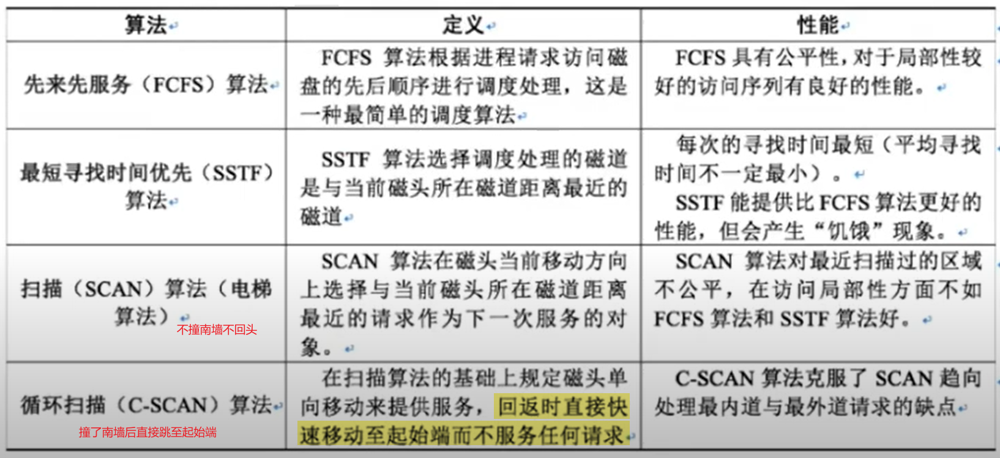
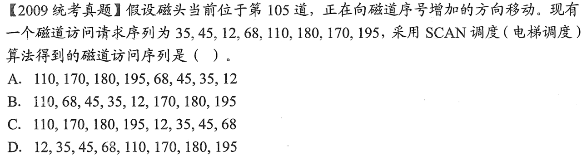
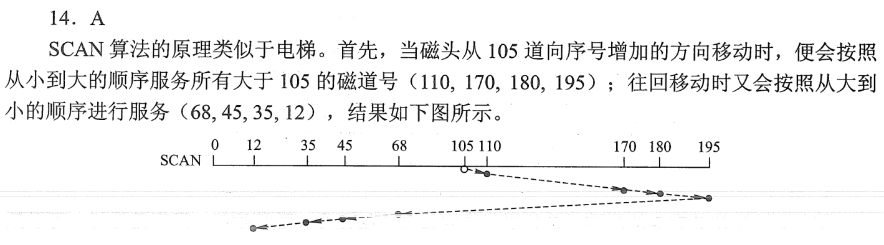

一次磁盘读写操作的实践由“寻找（寻道）时间”、“延迟时间”、“传输时间”决定：

| 时间            | 定义                                     | 决定因素     |
| --------------- | ---------------------------------------- | ------------ |
| 寻找时间$T_{s}$ | 将磁头移动到指定磁道所需时间             | 磁盘调度算法 |
| 延迟时间$T_{r}$ | 磁头定位到某一磁道的扇区（块号）所需时间 | 磁盘转速     |
| 传输时间$T_{t}$ | 从磁盘读出or磁盘写入数据所经历的时间     | 磁盘转速     |

磁盘调度算法：

例题：

