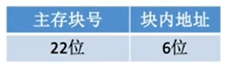
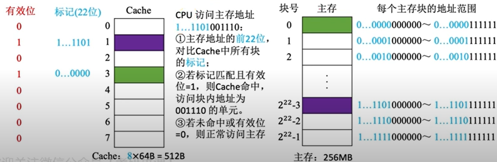
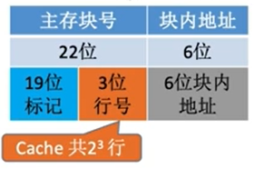
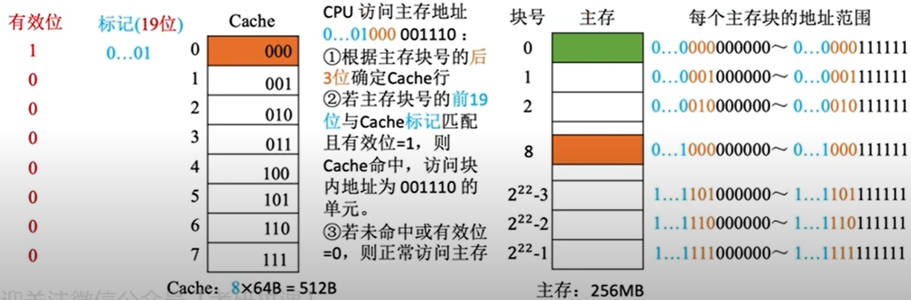
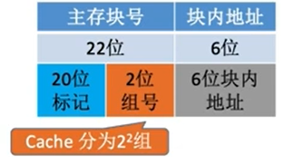
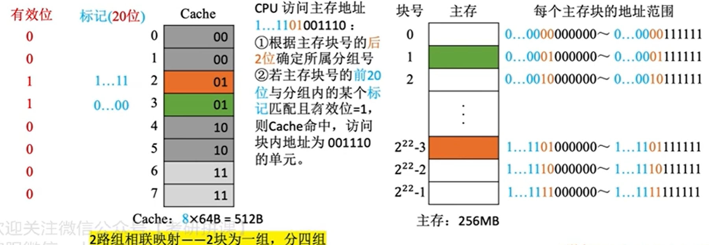

背景：

假设主存地址空间为256MB，按字节编址，某数据Cache有8行，行长为64B

> $256MB=2^{28}B$→地址总位数=28
>
> 行长为64B→块内偏移地址占6位
>
> Cache有8行→Cache行号占3位
>
> 主存块号占28-6-3=19位
>
> 注：Cache行即Cache块，是Cache与主存之间传送数据的基本单位→主存块大小=Cache行长

# 1.全相联映射

> 主存中的每一块可以可以装入Cache中的`任何空闲块`

全相联地址映射的地址结构：

 CPU访问主存地址：`1...1101`001110

> 1. 将主存地址的`前22位`，对比Cache中所有块的`标记位`；（==标记位的作用：指明当前Cache行对应哪一块主存，不同映射方式，标记位位数不同==）
> 2. 若标记匹配且有效位=1，则Cache命中→访问行内地址为001110的单元；
> 3. 若未命中or有效位=0，则正常访问主存。

# 2.直接映射

> 主存块只能存放在Cache中的`固定位置=主存块号%Cache总块数`
>
> 注：若Cache总块数$=2^{n}$，则主存块号末尾n位直接反映它在Cache中的行号（即末尾n位数值上=主存块号%Cache总块数）

直接相联地址映射的地址结构：

 

CPU访问主存地址：1...1`101`001110

> 1. 根据主存地址中主存块号位的`后3位`确定Cache行；
> 2. 若主存块号的前19位与Cache标记匹配且有效位=1，则Cache命中→访问行内地址为001110的单元；
> 3. 若未命中or有效位=0，则正常访问主存。

# 3.组相联映射

> 主存块存放至`特定分组=主存块号%分组数`

组相联地址映射的地址结构：

CPU访问主存地址：1...11`01`001110

> 1. 根据主存地址中主存块号位的`后2位`确定所属Cache分组组号；
> 2. 若主存块号的`前20位`与分组内的`某一个Cache标记匹配且有效位=1`，则Cache命中→访问行内地址为001110的单元；
> 3. 若未命中or有效位=0，则正常访问主存。

# 例题

题：某计算机的 Cache 共有 16 块，采用 2 路组相联映射方式，每个主存块大小为 32 字节，按字节编址。主存 129 号单元所在主存块应装入到 Cache 的组号是：

A：0	B：1	`C`：4	D：6

解：

> 16块Cache行，2 路组相联→总共有8组
>
> 每个主存块大小位32B，按字节编址→一个主存块含32个地址单元→主存129号单元位于第4号主存块（从0开始）→对应Cache组号=4%8=4

<iframe src="//player.bilibili.com/player.html?aid=70211798&bvid=BV1BE411D7ii&cid=121617139&page=67" scrolling="no" width="640px" height="480px" border="0" frameborder="no" framespacing="0" allowfullscreen="true"> </iframe>

