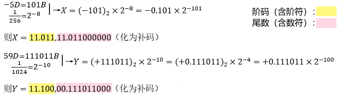

### 例题：

> 已知十进制数$ X=\frac{-5}{256}$，$Y=\frac{+59}{1024}$，按照机器补码浮点运算法则计算$X-Y$，结果用二进制表示，浮点数格式如下：
>
> 阶符取2位，阶码取3位，数符取2位，尾数取9位

### 解：

#### 0、用补码表示阶码与尾数

#### 1、对阶

> 使两个数的阶码真值相等，小阶向大阶看齐，==尾数每右移一位，阶码+1==

##### 1）求阶差

$[\Delta E]=11.011-11.100=11.011+00100=111111$，知$\Delta E=-1$

> 可知$Y$的阶码比$X$的阶码大1（可直接目测）

##### 2）对阶

$X=11.011,11.011000000→11.100,11.101100000→X=-(0.0101)\times2^{-100}$

#### 2、尾数运算

> ==$[X-Y]_{补码}=[X]_{补码}+[Y]_{补码}$，已知$[Y]_{补码}$，则$[-Y]_{补码}$就是将$[Y]_{补码}$连同符号位一起取反加一==

$[X-Y]_补=11.101100000+11.000101000=10.110001000(溢出，需\underline{右规})$

#### 3、规格化

$[X-Y]_补=11.100,10.110001000→11.101,11.\underline{0}11000100​$

#### 4、舍入

无舍入

#### 5、判溢出

阶符符号位为11，无溢出→==$X-Y=11.011,11.100111100$（补码化为原码）==

---

## 规格化

> 规定尾数的数值最高位必须为==有效值（通常为1）==

### 1）左规

当尾数出现$00.\underline{0}××...×$或$11.\underline{1}××...×$时，需左规（即尾数左移1位，阶码-1，直至尾数为$00.\underline{1}××...×$或$11.\underline{0}××...×$）

### 2）右规

当尾数求和结果溢出（如尾数为$10.×××...×$或$01.×××...×$）时，需右规（即尾数右移1位，阶码+1）

