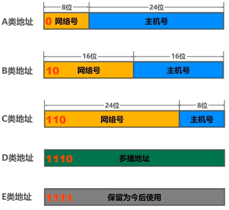
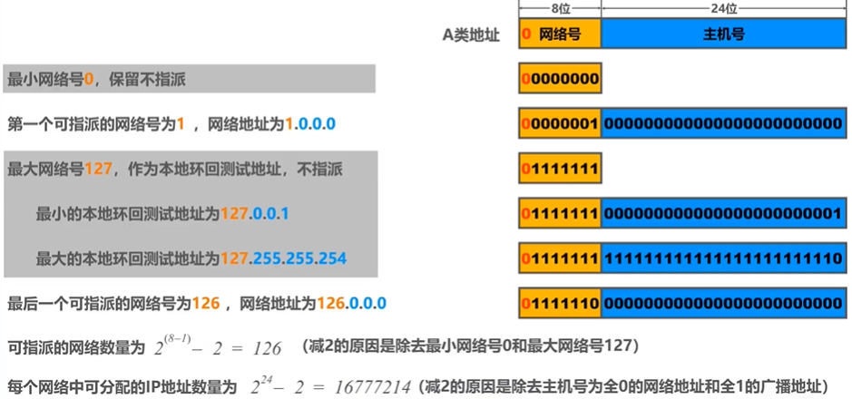
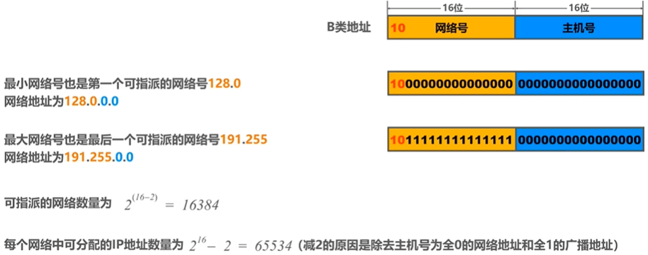
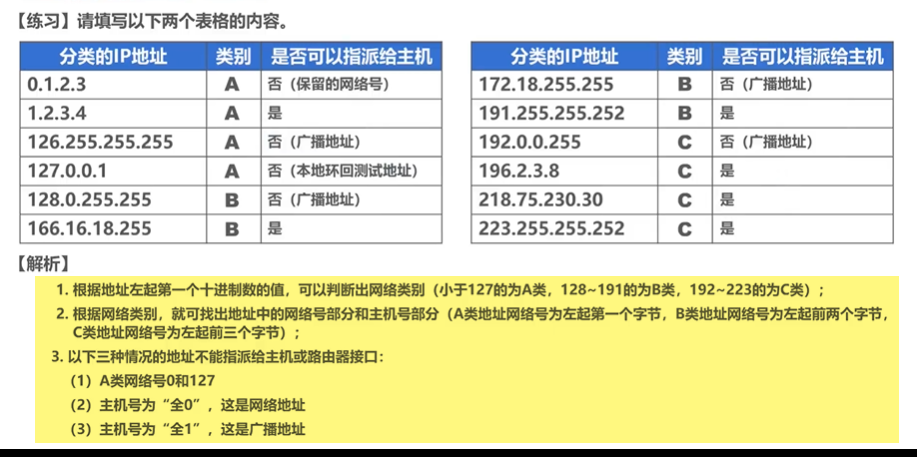

# IP地址编址阶段

## 1.分类编址的IPv4地址

> 注意事项：
>
> + 只有A类、B类和C类可分配给网络中的主机或路由器的各接口
> + 主机号为‘全0’的地址是网络地址，不能分配给主机或路由器的各接口
> + 主机号为‘全1’的地址是广播地址，不能分配给主机或路由器的各接口
> + A类网络网络号为0和127的不能分配给主机或路由器的各接口

### 1）A类地址

### 2）B类地址

### 3）C类地址

### 4）练习

## 2.划分子网的IPv4地址

## 3.无分类编址CIDR