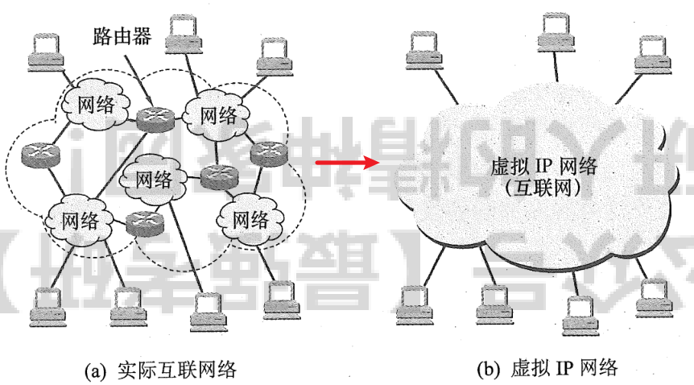
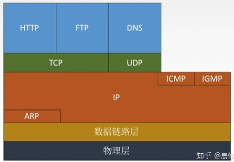
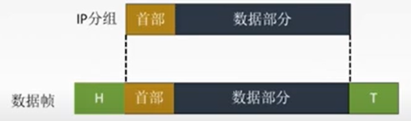

# 网络层功能

## 1.异构网络互联

Q：什么是网络互联？

A：指将2个以上的计算机网络，通过一定的方法，用一种或多种通信处理设备（即中间设备）相互连接起来，以构成更大的网络系统。（中间设备又称“中间系统”or“`中继系统`”）

Q：什么是异构网络互联？

通常指用`路由器`进行网络互联和路由选择

## 2.路由与转发

### 1）路由选择（确定哪一条路径）

指按照复杂的分布式算法，根据从各相邻路由器所得到的关于整个网络拓扑的变化情况，动态地改变所选择的路由。

> 根据特定的路由选择协议构造出路由表，同时经常或定期地和相邻路由器交换路由信息而不断地更新和维护路由表。

### 2）分组转发（当一个分组到达时所采取的动作）

指路由器根据转发表将用户的 IP 数据报从合适的端口转发出去。

> 后者处理通过路由器的数据流，关键操作是转发表查询、转发及相关的队列管理和任务调度等。

注：路由表是根据路由选择算法得出的，而转发表是从路由表得出的。转发表的结构应当使查找过程最优化，路由表则需要对网络拓扑变化的计算最优化。在讨论路由选择的原理时，往往`不去区分转发表和路由表`，而是笼统地使用路由表一词。

## 3.拥塞控制

若所有得结点都来不及接受分组，而要丢弃大量分组的话，网络层就处于拥塞状态。

### 1）开环控制（静态→pre）

在设计网络时事先将有关发生拥塞的因素考虑周到，力求网络在工作时不产生拥塞。这是一种静态的预防方法。一旦整个系统启动并运行，中途就不再需要修改。开环控制手段包括确定何时可接收新流量、何时可丢弃分组及丢弃哪些分组，确定何种调度决策等。所有这些手段的共性是，在做决定时不考虑当前网络的状态。 

### 2 ）闭环控制（动态→ing）

事先不考虑有关发生拥塞的各种因素，采用监测网络系统去监视，及时检测哪里发生了拥塞，然后将拥塞信息传到合适的地方，以便调整网络系统的运行，并解决出现的问题。闭环控制是基于反馈环路的概念，是一种动态的方法。

# 路由算法

最佳路由：“最佳”只能是相对于某一特定要求下得出的较为合理的选择而已。

## 1.路由算法分类

### 1）静态路由算法（非自适应路由算法）

管理员手动配置路由信息

> 优点：简便、可靠，在负荷稳定，`拓扑变化不大`的网络中运行效果很好，广泛用于高度安全性的军事网络和较小的商业网络中。
>
> 缺点：路由更新慢，不适用大型网络。

### 2）`动态路由算法`

路由器间 彼此交换信息，按照路由算法优化出路由表项。

> 优点：路由更新快，适用于大型网络，即使响应链路费用或网络拓扑变化。
>
> 缺点：算法复杂，增加网络负担。

#### ①全局性

所有路由器掌握完整的网络拓扑和链路费用信息。（典型应用：链路状态路由算法`OSPF`）

#### ②分散性

路由器只掌握物理相连的邻居及链路费用。（典型应用：举例向量路由算法`RIP`）

## 2.分层次的路由选择协议

### 1）前言

Q1：为什么要分层？

> A1：因特网规模庞大（如果每个路由器都知道全局信息那么整个网络将会变得庞杂臃肿）+许多单位不想将自己的路由选择情况暴露给外界。

Q2：什么是分层？

> A2：通俗解释：将互联网分成一个个小的团体单位，每一个团体单位称为`自治系统`。例如，一所大学、一个公司，政府的一个部门等。（自治系统AS：`系统内部`采用一种路由选择协议，`系统外部`采用另一种路由选择协议。）

> 可以认为 AS 类似于一个城镇的邮局。邮件从一个邮局到另一个邮局，直到到达正确的城镇为止，然后该城镇的邮局将在该城镇内传递邮件。与之类似，数据包在整个 Internet 范围内通过从 AS 跳到 AS，直到它们到达包含其目的地 [Internet 协议（IP）](https://www.cloudflare.com/zh-cn/learning/ddos/glossary/internet-protocol)地址的 AS。该 AS 中的路由器将数据包发送到 [IP 地址](https://www.cloudflare.com/zh-cn/learning/dns/glossary/what-is-my-ip-address) 。
>
> 每个 AS 都控制一组特定的 IP 地址，就像每个镇的邮局负责将邮件传递到该镇内的所有地址一样。给定 AS 可以控制的 IP 地址范围称为其“IP 地址空间”。

### 2）路由选择协议分类

> 自治系统AS：`系统内部`路由器采用一种路由选择协议进行分组转发，`系统外部`路由器间（AS之间）采用另一种路由选择协议进行分组转发。

①内部网关协议`IGP`

> 一个AS内部使用的，如RIP、OSPF

②外部网关协议`EGP`

> AS之间使用的，如BGP

# IP数据报格式

## 1.TCP/IP协议栈

Q1：为什么会有TCP/IP协议？

> A1：在世界上各地，各种各样的电脑运行着各自不同的操作系统为大家服务，这些电脑在表达同一种信息的时候所使用的方法是千差万别。就好像圣经中上帝打乱了各地人的口音，让他们无法合作一样。计算机使用者意识到，计算机只是单兵作战并不会发挥太大的作用。只有把它们联合起来，电脑才会发挥出它最大的潜力。于是人们就想方设法的用电线把电脑连接到了一起。
>
> 但是简单的连到一起是远远不够的，就好像语言不同的两个人互相见了面，完全不能交流信息。因而他们需要定义一些共通的东西来进行交流，TCP/IP就是为此而生。TCP/IP不是一个协议，而是一个协议族的统称。里面包括了IP协议，IMCP协议，TCP协议，以及我们更加熟悉的http、ftp、pop3协议等等。电脑有了这些，就好像学会了外语一样，就可以和其他的计算机终端做自由的交流了。

## 2.IP数据报格式

<iframe src="//player.bilibili.com/player.html?aid=79742127&bvid=BV1PJ411t7wM&cid=136473082&page=1" scrolling="no" border="0" frameborder="no" framscrolling="no" width="640px" height="480px" border="0" frameborder="no" framespacing="0" allowfullscreen="true"> </iframe>

+ 首部长度

  > ①占4bit，标识IP数据报首部的长度。该字段的取值以4字节为单位。
  >
  > ②`最小十进制取值为5（即0101）`，表示IP数据报首部只有20字节固定部分;
  >
  > ③最大十进制取值为15（即1111）,表示IP数据报首部包含20字节固定部分和最大40字节可变部分；
  >
  > ④可选字段长度从1个字节到40个字节不等，用来支持排错、测量及安全等措施；
  >
  > 注：1、可选字段增加了IP数据报的功能，但这同时也使得IP数据报的首部长度成为可变的。这就增加了每一个路由器处理IP数据报的开销，实际上可选字段很少被使用。2、填充字段`确保首部长度为4字节的整数倍`，使用全0进行填充。

+ 总长度：首部长度+数据部分长度（单位为1B）；

+ 生存时间（TTL）：IP分组的保质期，每经过一个路由器生成时间-1，直至变为0则丢弃当前IP分组；

+ 协议：数据部分采用什么协议，占8位（版本号表示首部采用什么协议）（`6-TCP协议；17-UDP协议`）

+ 首部检验和：只检验首部

## 3.IP数据报分片

### 1）最大传送单元MTU

链路层数据帧可封装数据的上限（以太网的MTU是1500字节）

+ 标识：统一数据报的分片使用同一标识

+ 标志：占3位`_ _ _`（只有后2位有意义）

  > 最高位（从左至右第一位）：保留（不使用）
  >
  > 中间位DF（Don't Fragment）：DF=1表示禁止分片；DF=0表示允许分片
  >
  > 最低位MF（More Fragment）：MF=1表示当前分片不是最后一片分片；MF=0表示当前分片是最后一片分片

+ 片偏移：占13bit，指出当前分片数据部分在原IP数据报的相对位置（单位为8B）（即`当前分片数据部分第一个字节在原数据报的位置`/`8`的值）