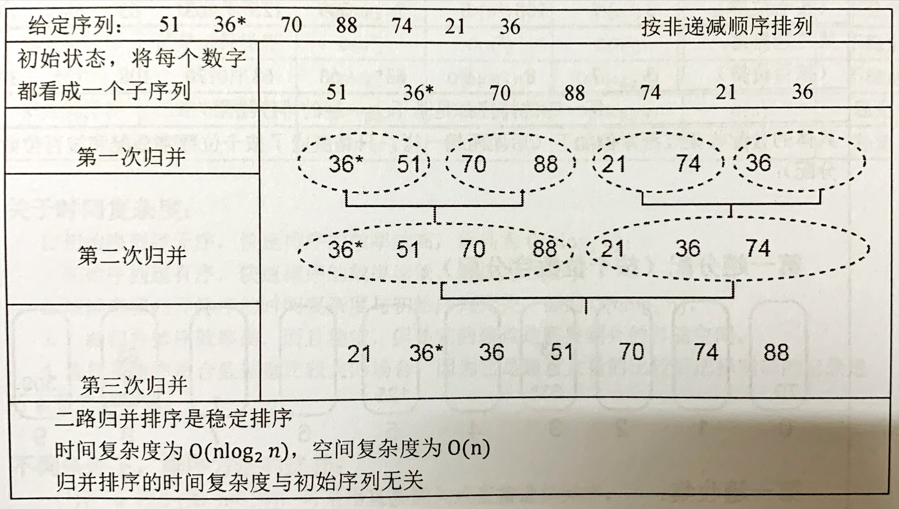
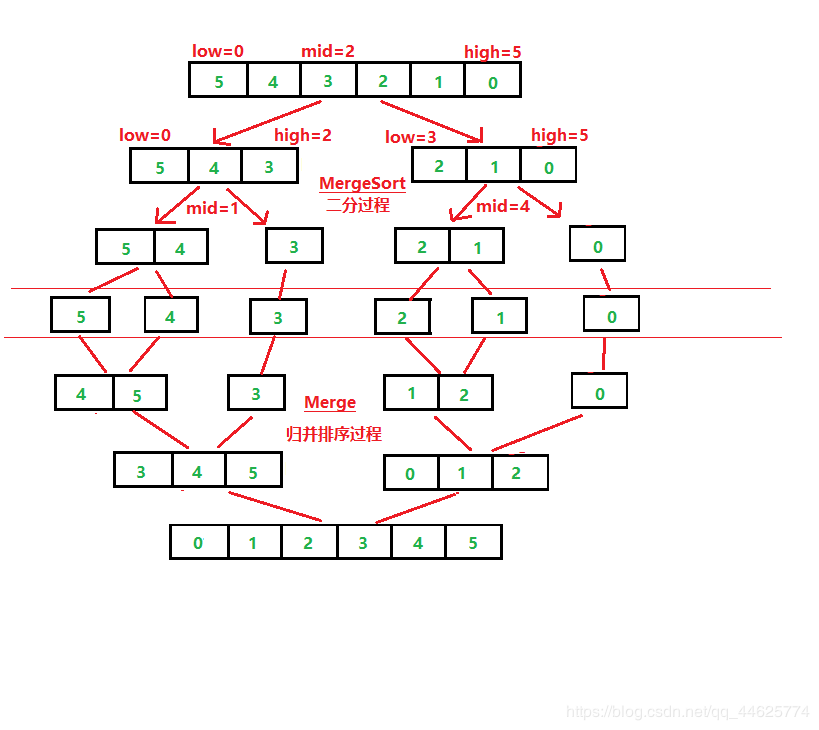
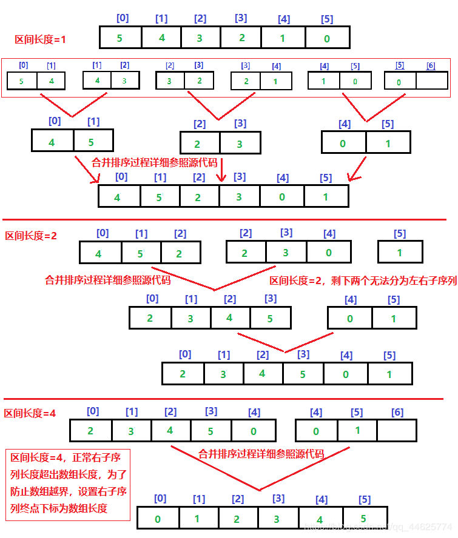

## 一、算法思想：

假设初始序列中含有N个记录，则可以看成N个有序的子序列，每个子序列的长度为一，然后两两归并，得到$[\frac{N}{2}]$（表示不小于2的最小整数）个长度为2或者1的有序子序列：再两两归并，如此重复，直到得到一个长度为N的有序子序列为止，称为2路归并排序（Merge Sort)。

## 二、算法实现

### 1、递归实现

#### 1）排序原理

归并排序的递归实现主要在于递归分治，对于递归算法，我们都能用二叉树来理解，对于一个序列，递归左右子序列，并对其子序列进行合并排序，即可得到排序好的序列
<mark>排序过程图示</mark>

#### 2）代码实现

~~~c
#include<stdio.h>
#include<stdlib.h>
#define N 10
void Merge(int sort[],int num[],int low,int mid,int high)
{
    int i=low;      //左子序列起点下标
    int j=mid+1;    //右子序列起点下标
    int k=low;      //临时数组的初始化下标
    while(i<=mid&&j<=high)//在左右子序列中按从小到大顺序存到临时数组中
    {
        if(num[i]<num[j])
            sort[k++]=num[i++];
        else
            sort[k++]=num[j++];
    }
    //将左右子序列剩余的数依次存入临时数组
    while(i<=mid)
        sort[k++]=num[i++];
    while(j<=high)
        sort[k++]=num[j++];
    //将临时数组的数据按位置复制到原数组对应位置上
    while(--k>=0)
        num[k]=sort[k];
}
void MergeSort(int sort[],int num[],int low,int high)
{
    if(low<high)
    {
        int mid=(low+high)/2;           //分为左右子序列的中间下标
        MergeSort(sort,num,low,mid);    //递归左子序列
        MergeSort(sort,num,mid+1,high); //递归右子序列
        Merge(sort,num,low,mid,high);   //排序
    }
}
int main()
{
    int *sort;
    int num[N]={5,3,7,1,9,2,0,4,8,6};
    sort=(int*)malloc(N*sizeof(int));
    MergeSort(sort,num,0,N-1);
    for(int i=0;i<N;i++)
        printf("%d ",num[i]);
    printf("\n");
    free(sort);
    return 0;
}
~~~

### 2、非递归实现

#### 1）排序原理

归并排序的非递归实现主要在于子序列的划分；
1、首先需要一个<mark>临时数组</mark>以及<mark>左右两个子序列的区间</mark>；
2、从**区间长度**为1开始（递增两倍）将原数组划分成<mark>多对</mark>左右两个子序列；
3、依次将<mark>多对</mark>左右子序列进行比较，并按顺序存入临时数组中
4、再将临时数组排序好的序列再复制到原数组中
5、最后**区间长度**两倍增长，重复以上操作，即<mark>归并</mark>
<mark>排序过程图示</mark>

#### 2）代码实现

~~~c
#include<stdio.h>
#include<stdlib.h>
#define N 10
 
void MergeSort(int num[],int len)
{
    int i,j;
    int *sort;
    int L_start=0,L_end=0;//初始化左区间的起点、终点下标
    int R_start=0,R_end=0;//初始化右区间的起点、终点下标
 
    sort=(int*)malloc(N*sizeof(int));//为临时数组分配空间
 
    for(i=1;i<N;i*=2)//区间长度两倍递增
    {
        for(L_start=0;L_start<len-i;L_start=R_end)
        {
            //确定左右区间两边的起点、终点下标
            L_end   = L_start+i;
            R_start = L_start+i;
            R_end   = R_start+i;
 
            if(R_end>len)//右区间终点不超过数组长度
            {
                R_end=len;
            }          
            j=0;    //临时数组初始下标
 
            while(L_start<L_end && R_start<R_end)
            {
                //比较左右起点数据的大小，并将较小的数据依次存入临时数组
                if(num[L_start]<num[R_start])   
                    sort[j++]=num[L_start++];
                else
                    sort[j++]=num[R_start++];
                //同时起点下标递增
            }
     
            while(L_start<L_end)//将比较完剩余的数据存入临时数组
            {
                sort[j++]=num[L_start++];
            }  
            while(j>0)           //将已排好的临时数组数据录入原数组中
            {
                num[--R_start]=sort[--j];
            }
 
            //for(int k=0;k<len;k++)
            // printf("%d ",num[k]);
            //printf("\n");
        }
    //printf("-------------\n");
    }
    free(sort);
}
 
int main()
{
    int num[N]={5,3,7,1,9,2,0,4,8,6};
    MergeSort(num,N);
    for(int i=0;i<N;i++)
        printf("%d ",num[i]);
    printf("\n");
    return 0;
}
~~~

