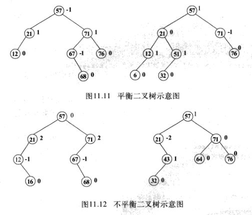

二叉排序树查找在最坏的情况下，二叉排序树的深度为n,其平均查找长度为n。因此，为了减小二叉排序树的查找次数，需要进行平衡化处理，平衡化处理得到的二叉树称为平衡二叉树。

# 1.平衡二叉树的定义

平衡二叉树或者是一棵空二叉树，或者是具有以下性质的二叉树（平衡二叉树也称为AVL树）：

+ 平衡二叉树的左子树和右子树的深度之差的绝对值小于等于1；
+ 左子树和右子树也是平衡二叉树。

如果将二叉树中结点的平衡因子定义为结点的左子树与右子树之差，则平衡二叉树中每个结点的平衡因子的值只有三种可能：==-1、0和1==。例如，图11.11所示即为平衡二叉树，结点的右边表示平衡因子，因为该二叉树既是二叉排序树又是平衡树，因此，该二又树称为平衡二叉排序树。如果在二叉树中有一个结点的平衡因子的绝对值大于1,则该二叉树是不平衡的。例如，图11.12所示为不平衡的二叉树。

