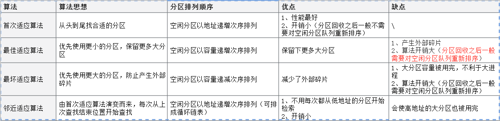

连续分配方式是指：为用户程序分配`一个连续的内存空间`

## 1.单一连续分配

内存中只能有一道用户程序，用户程序独占整个用户空间

缺点：只能用于当用户、单任务操作系统，有内部碎片、存储器利用率极低

## 2.固定分区分配

将用户内存空间划分为若干个固定大小的区域，每个分区装入一个作业。

固定分区分配在划分分区时有2种不同的方法：分区大小相等&分区大小不等。

缺点：1）程序太大时分区装不下；2）程序太小时也要占用一个分区，产生内部碎片。

> 内部碎片：分配给某进程的内存区域中，如果有些部分没用上；
>
> 外部碎片：指内存中的某些空间分区由于太小而难以利用。

## 3.`动态分区分配`

