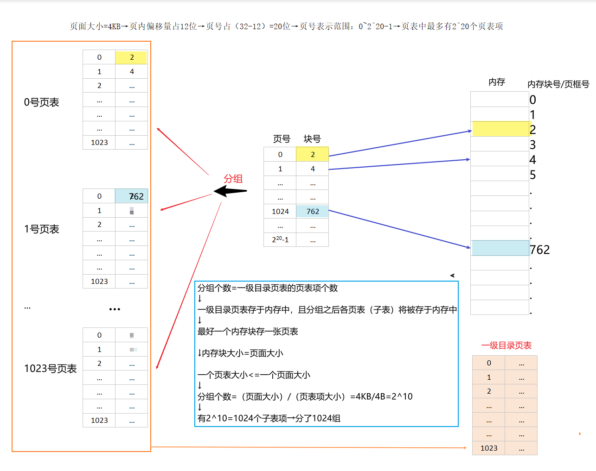

非连续分配：将一个程序分散装入不相邻的内存分区（离散存储）。

# 1.分页存储管理

## 1）基本概念

> 将主存和进程都划分为大小相等且固定的`块`，进程以块为单位申请主存

### ① 页面和页框

`页`：进程中的块（别名：页面）

`页框`：内存中的块（别名：页帧=内存块=物理块=物理页面）

### ②地址结构（逻辑地址结构）

### ③页表

+ 页表：记录进程各页面与主存块之间的对应关系

+ 页表由`页表项`组成，页表项=页号+块号（页表项是连续存放的，因此`页号是隐含的`，不占存储空间，类似于数组下标）

  

+ 硬件支持：页表的功能由一组专门的存储器实现，其始地址存放在页表寄存器（PTR）中，存放页表在内存的始地址和页表长度（“始址”and“页表长度”一般存放于进程的PCB中，只有进程执行时，才将“始址”and“页表长度”存入PTR→系统中通常只设置`1个`PTR）

## 2）基址地址变换机构

xxxxx（略）

# 2.分段存储管理

## 1）基本概念

> 按照程序自身的逻辑关系划分为若干个`段`

### ①地址结构（逻辑地址结构）

段号：决定了作业的最大段数；

段内偏移量：决定了`最大段长`。

### ②段表

+ 段表：记录逻辑空间与主存空间的映射关系

+ 段表由段表项组成，段表项=段号+`段长（因为每个段的长度不一）`+本段在主存的起始地址（段表项是连续存放的，因此`段号是隐含的`，不占存储空间，类似于数组下标）

  

+ 硬件支持：段表寄存器，用于存放段表的始地址和段表长度TL

---

# 单级页表存在的问题：

## Q1：

页表必须连续存放，因此当页表很大时，需占用很多连续的内存块

> 解决：采用`多级页表结构`
>
> 将单级页表`分组`，各组离散存于内存，建立`一级目录页表`用于记录各组页表的映射关系

例子：32位逻辑地址空间，页表项大小为4B，页面大小为4KB，若采用2级页表结构，应分成几组？

